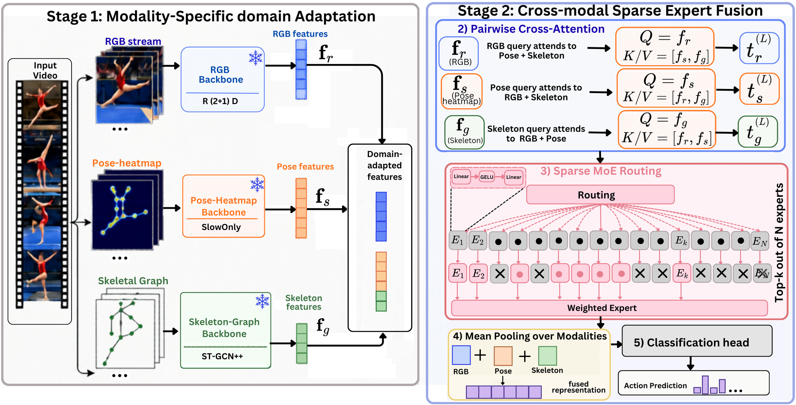
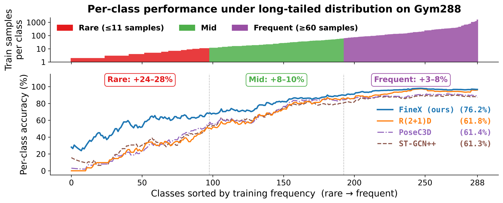
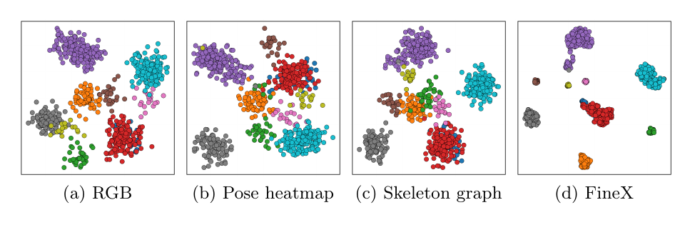

# FineX: Fine-Grained Action Recognition with Cross-Attentive Latent Sparse Experts

**Imtiaz Ul Hassan\***, **Tasweer Ahmad\***, **Nik Bessis**, **Ardhendu Behera**†
Computer Science Department, Edge Hill University, United Kingdom
\* Equal contribution  † Corresponding author

[](https://arxiv.org/html/2608.13458v1)

📄 **Paper:** [arXiv:2608.13458](https://arxiv.org/html/2608.13458v1)

> **Code:** The training code for both stages is in this repository. Pretrained weights will be released soon.

---

## Overview

Fine-grained human action recognition (FHAR) has to tell apart actions that look almost the same. They differ mainly in body configuration, timing, or local appearance, such as the number of somersaults in a dive or the order of sub-actions in a gymnastics routine. Each common input type misses part of this:

- **RGB** keeps visual context but loses joint-level geometry.
- **Skeletons** keep kinematics but lose dense spatial detail.

**FineX** splits the evidence into three complementary streams and fuses them:

| Stream | What it captures | Backbone |
|---|---|---|
| **RGB appearance** | Visual context, local motion | R(2+1)D-34 (IG-65M init.) |
| **Pose-heatmap geometry** | Image-plane joint and limb locations | PoseC3D (SlowOnly-R50) |
| **Skeletal-graph topology** | Inter-joint structure and kinematics | ST-GCN++ |

Two components combine the streams:

1. **Pairwise cross-attention.** Each stream queries the other two. This exchange is symmetric and keeps each stream's identity, so FineX does not need concatenation or late fusion.
2. **Streamwise latent sparse Mixture-of-Experts.** One shared bank of latent experts serves all streams. Each stream's representation is routed to its top-*k* experts based on its content. A load-balancing loss stops the router from collapsing onto a few experts.

FineX reaches **state-of-the-art** results on **Gym99**, **Gym288**, and **Diving48**. On the long-tailed Gym288 benchmark it raises mean class accuracy from **68.6% to 76.2% (+7.6 points)**. It does this without textual supervision or large-scale vision–language pre-training.

---

## Architecture

<p align="center">
  
</p>

FineX is trained in two stages.

**Stage 1: modality-specific domain adaptation.** The three backbones are fine-tuned separately on the target dataset and then frozen. Their penultimate-layer features are cached:
f<sub>r</sub>, f<sub>s</sub> ∈ ℝ<sup>512</sup> and f<sub>g</sub> ∈ ℝ<sup>256</sup>.

**Stage 2: cross-modal sparse expert fusion.** This stage trains only a lightweight fusion module (7.5M parameters) on the cached features.

1. **Projection.** Each feature is projected to a shared dimension *D*.
2. **Pairwise cross-attention** (*L* layers). Each stream acts as a query. The other two streams supply the keys and values:

   t<sub>m</sub><sup>(ℓ)</sup> = LN[ t<sub>m</sub><sup>(ℓ−1)</sup> + MHA( t<sub>m</sub><sup>(ℓ−1)</sup>, C<sub>m</sub>, C<sub>m</sub> ) ],  where C<sub>m</sub> = [t<sub>m′</sub>]<sub>m′ ≠ m</sub>

   Attention parameters are shared within a layer. Each stream asks a different query, so each one retrieves different complementary evidence.
3. **Sparse MoE routing.** A bias-free linear router scores *N* bottleneck FFN experts (Linear → GELU → Dropout → Linear) for each stream. The top-*k* experts are activated and their outputs are combined using renormalised softmax weights.
4. **Mean pooling** over the three refined streams.
5. **Classification head:** LayerNorm → Dropout → Linear.

**Training objective.** Label-smoothed cross-entropy (ε = 0.1) plus a load-balancing loss (λ<sub>lb</sub> = 0.1):

L = CE<sub>ε</sub>(ŷ, y) + λ<sub>lb</sub> · N Σ<sub>i</sub> f<sub>i</sub> q<sub>i</sub>

Here f<sub>i</sub> is how often expert *i* is selected, and q<sub>i</sub> is its mean router probability. Both are computed over all 3B routing decisions in a mini-batch: B samples × 3 streams.

**Default hyper-parameters:** D = 512, L = 3, H = 8 heads, N = 16 experts, d<sub>e</sub> = 256, k = 8. Training uses Adam (lr 3×10⁻⁴, weight decay 10⁻³) with cosine schedule and gradient clipping for up to 80 epochs.

---

## Results

### Comparison with state-of-the-art

Top-1 accuracy and Mean Class Accuracy (MCA) in %. Input types: R = RGB, P = Pose, T = Text.

| Model | Venue | Input | Gym99 Top-1 | Gym99 MCA | Gym288 Top-1 | Gym288 MCA | Diving48 Top-1 |
|---|---|:-:|:-:|:-:|:-:|:-:|:-:|
| TSN | TPAMI'18 | R | 74.8 | 61.4 | 68.3 | 26.5 | – |
| I3D | CVPR'17 | R | 75.6 | 64.4 | 66.1 | 28.2 | – |
| TSM | ICCV'19 | R | 80.4 | 70.6 | 73.5 | 34.8 | – |
| SlowFast | ICCV'19 | R | 93.9 | 90.6 | 86.8 | 51.2 | – |
| TQN | CVPR'21 | R | 93.8 | 90.6 | 89.6 | 61.9 | 81.8 |
| ST-GCN++ | ACM MM'22 | P | 94.2 | 91.9 | 85.9 | 61.3 | 85.9 |
| PoseC3D | CVPR'22 | P | 94.4 | 92.0 | 87.2 | 61.4 | 82.8 |
| TAG-Head | ICPR'26 | R | 95.6 | 93.8 | 92.2 | 68.6 | – |
| HiOD | ICCV'25 | P | 96.3 | – | – | – | – |
| PGVT | WACV'24 | R+P | 96.7 | 91.6 | 91.0 | 63.6 | 91.3 |
| MFCF | BMVC'25 | R+P | 96.0 | – | – | – | – |
| PeVL | CVPR'24 | R+T+P | 97.0 | 91.8 | 91.8 | 64.0 | 92.5 |
| **FineX (ours)** | – | R+P | **97.1** | **96.4** | **94.3** | **76.2** | **92.9** |

ST-GCN++ and PoseC3D were trained from scratch on the pose data extracted by our pipeline. Full table in the paper.

### Long-tail per-class behaviour on Gym288

<p align="center">
  
</p>

Each single-stream backbone reaches about 61% MCA. FineX reaches **76.2%**, which is **+14.4 points** over the best of them. The gains are largest on **rare classes (+24–28%)**, followed by mid-frequency classes (+8–10%) and frequent classes (+3–8%).

### Feature embeddings (t-SNE, Gym288)

<p align="center">
  
</p>

The single-stream embeddings show clear overlap between classes. FineX forms compact, well-separated clusters.

### Ablations

**Component ablation**

| Cross-attn. | Sparse MoE | Gym99 Top-1 / MCA | Gym288 Top-1 / MCA | Diving48 Top-1 |
|:-:|:-:|:-:|:-:|:-:|
| ✗ | ✓ | 95.3 / 95.2 | 92.4 / 73.6 | 92.1 |
| ✓ | ✗ | 95.8 / 95.2 | 92.7 / 74.1 | 92.1 |
| ✓ | ✓ | **97.1 / 96.4** | **94.3 / 76.2** | **92.9** |

**Cross-stream complementarity.** R = RGB, P = Pose-Heatmap, S = Skeletal Graph.

| R | P | S | Gym99 Top-1 / MCA | Gym288 Top-1 / MCA | Diving48 Top-1 |
|:-:|:-:|:-:|:-:|:-:|:-:|
| ✓ | | | 93.6 / 91.5 | 89.1 / 68.0 | 87.5 |
| | | ✓ | 94.1 / 92.1 | 85.6 / 62.8 | 86.2 |
| | ✓ | | 94.6 / 92.5 | 86.3 / 67.7 | 82.7 |
| | ✓ | ✓ | 95.6 / 94.0 | 87.9 / 68.5 | 87.4 |
| ✓ | ✓ | | 96.3 / 94.9 | 93.2 / 74.3 | 89.6 |
| ✓ | | ✓ | 96.8 / 95.9 | 93.6 / 74.8 | 91.7 |
| ✓ | ✓ | ✓ | **97.1 / 96.4** | **94.3 / 76.2** | **92.9** |

The best values in the other ablations are λ<sub>lb</sub> = 0.1 for the load-balance weight and *k* = 8 of N = 16 experts. Single-expert routing (*k* = 1) and dense routing (*k* = 16) both perform worse. See the paper for details.

### Efficiency (Diving48)

| Method | Total Params (M) | Tunable (M) | GFLOPs | Top-1 | Input |
|---|:-:|:-:|:-:|:-:|:-:|
| AIM ViT-B/16 | 97 | 11 | 809 | 88.9 | R |
| AIM ViT-L/14 | 341 | 38 | 3,736 | 90.6 | R |
| **FineX (ours)** | **75.2** | **7.5** | **682** | **92.9** | R+P |

---

## Installation

FineX reuses the RGB data pipeline from our earlier work, [TAG-Head](https://github.com/ImtiazUlHassan/Tag-Head) (ICPR 2026). That pipeline uses **NVIDIA DALI** for GPU video decoding. Our experiments used **Python 3.12**, **PyTorch 2.x** and **CUDA 12.x**.

### 1. Clone the repository

```bash
git clone https://github.com/ImtiazUlHassan/FineX.git
cd FineX
```

### 2. Create a conda environment

```bash
conda create -n finex python=3.12
conda activate finex
```

### 3. Install PyTorch

Get the exact command for your CUDA version from [pytorch.org](https://pytorch.org/get-started/locally/).

```bash
# CUDA 12.1
pip install torch torchvision --index-url https://download.pytorch.org/whl/cu121

# CUDA 11.8
pip install torch torchvision --index-url https://download.pytorch.org/whl/cu118
```

Check that PyTorch can see your GPU:

```bash
python -c "import torch; print(torch.__version__, torch.cuda.is_available())"
```

### 4. Install NVIDIA DALI

The RGB stream uses DALI to decode and augment video on the GPU.

```bash
# CUDA 12.x
pip install nvidia-dali-cuda120

# CUDA 11.x
pip install nvidia-dali-cuda110
```

Check the install:

```bash
python -c "import nvidia.dali as dali; print(dali.__version__)"
```

### 5. Install remaining dependencies

```bash
pip install -r requirements.txt
```

### 6. Install PyTorch Geometric (ST-GCN++ stream)

Match the wheel URL to your PyTorch and CUDA versions. Available wheels are listed at https://data.pyg.org/whl/.

```bash
pip install torch-geometric
# Replace torch-2.1.0+cu121 with your torch+cuda combination
pip install torch-scatter torch-sparse -f https://data.pyg.org/whl/torch-2.1.0+cu121.html
```

### 7. Pose extraction dependencies (optional)

You only need these if you extract poses yourself instead of downloading the provided `.pkl`:

```bash
pip install transformers decord pillow scipy gdown
```

Pose extraction uses `VitPoseForPoseEstimation` and `DFineForObjectDetection`, so you need a recent `transformers` release that includes both.

---

## Dataset Preparation

### Videos

| Dataset | Classes | Train clips | Test clips | Source |
|---|:-:|:-:|:-:|---|
| FineGym Gym99 (v1.1) | 99 | ~20K | ~8.5K | [FineGym](https://sdolivia.github.io/FineGym/) |
| FineGym Gym288 (v1.1) | 288 | ~23K | ~9.6K | [FineGym](https://sdolivia.github.io/FineGym/) |
| Diving48 | 48 | ~16.1K | ~2.3K | [Diving48](http://www.svcl.ucsd.edu/projects/resound/dataset.html) |

**FineGym:**
1. Download the raw YouTube videos and the v1.1 temporal annotations from the [FineGym project page](https://sdolivia.github.io/FineGym/).
2. Cut out the action clips with our extraction script: [FinegymVideoextractions](https://github.com/ImtiazUlHassan/FinegymVideoextractions).

**Diving48:** Download the RGB videos and the official train/test splits from the [Diving48 project page](http://www.svcl.ucsd.edu/projects/resound/dataset.html).

Put the train and val clips in separate folders, with one sub-folder per class (the CSV `Class` column):

```
<dataset>/videos/
├── train/
│   ├── {class_id}/
│   │   ├── clip1.mp4
│   │   └── ...
│   └── ...
└── val/
    └── {class_id}/ ...
```

### Split CSVs

Each split is described by a CSV file in the same format as TAG-Head:

```
FileName,Class,TotalFrames,ClassEncoded
video_clip.mp4,ClassName,64,0
...
```

The Gym288 split CSVs are in [`data/`](data/). The Gym99 CSVs are in the [TAG-Head repository](https://github.com/ImtiazUlHassan/Tag-Head/tree/main/data).

### Video codec requirement (DALI)

The DALI video reader needs **every video in a dataset to use the same codec**. We recommend H.264. A dataset with mixed codecs causes a runtime error.

First, count the codecs used in your dataset:

```bash
find /path/to/videos/ -name "*.mp4" | \
  xargs -P8 -I{} ffprobe -v quiet -select_streams v:0 \
    -show_entries stream=codec_name -of csv=p=0 {} 2>/dev/null | \
  sort | uniq -c
```

If any videos are not H.264, list them and convert them in place:

```bash
find /path/to/videos/ -name "*.mp4" | \
  xargs -P8 -I{} sh -c \
  'codec=$(ffprobe -v quiet -select_streams v:0 -show_entries stream=codec_name -of csv=p=0 "{}" 2>/dev/null); [ "$codec" != "h264" ] && echo "{}"' \
  > non_h264.txt

while read f; do
  tmp="${f%.mp4}_tmp.mp4"
  ffmpeg -y -i "$f" -c:v libx264 -crf 18 -preset fast -an "$tmp" && mv "$tmp" "$f"
done < non_h264.txt
```

### Pose extraction

Both pose streams read 2D keypoints from one annotation file in PySKL format (`.pkl`).

**Ready-made Gym288 poses:** download [`finegym288_dfine_vitpose.pkl`](https://drive.google.com/file/d/1fK2cGGDIY8YQYOaVbJU23ycTl0MUy5pV/view?usp=sharing) (Google Drive). With this file you can skip pose extraction for Gym288.

```bash
pip install gdown
gdown 1fK2cGGDIY8YQYOaVbJU23ycTl0MUy5pV -O data/finegym288_dfine_vitpose.pkl
```

**Extracting poses yourself.** Each frame goes through two steps. First, [D-FINE](https://huggingface.co/ustc-community/dfine-xlarge-coco) (`dfine-xlarge-coco`, score threshold 0.4) detects people and keeps only the **largest person box**. Then [ViTPose++-Large](https://huggingface.co/usyd-community/vitpose-plus-large) (COCO head) estimates 17 COCO keypoints inside that box. Both models are loaded through Hugging Face `transformers`, and videos are decoded with `decord`.

```bash
python tools/extract_poses.py \
    --csv_train       data/FineGym288_train.csv \
    --csv_val         data/FineGym288_val.csv \
    --video_dir_train /path/to/gym288/videos/train/ \
    --video_dir_val   /path/to/gym288/videos/val/ \
    --output_pkl      data/finegym288_dfine_vitpose.pkl
```

- Videos are read from `<video_dir>/<ClassEncoded>/<FileName>`.
- The `.pkl` is saved after every video. If the run is interrupted, re-running the same command skips the clips that are already done.
- On a CUDA error, the script saves its progress and exits, so you can resume.
- Videos that fail for other reasons are skipped and listed at the end.

| Dataset | Person detector | Pose estimator |
|---|---|---|
| Gym99 | – | PySKL HRNet keypoints ([provided by PySKL](https://github.com/kennymckormick/pyskl/blob/main/tools/data/README.md)) |
| Gym288 | D-FINE xlarge | ViTPose++-L |
| Diving48 | D-FINE xlarge | ViTPose++-L |

**`.pkl` format.** A dict with two keys:

```python
{
  "split": {"train": [frame_dir, ...], "val": [frame_dir, ...]},
  "annotations": [
    {
      "frame_dir": "clip_id",          # CSV FileName without .mp4
      "label": 0,                      # ClassEncoded
      "img_shape": (H, W),
      "original_shape": (H, W),
      "total_frames": T,
      "keypoint": np.ndarray,          # float16 [1, T, 17, 2]  (largest person, COCO-17, pixels)
      "keypoint_score": np.ndarray,    # float16 [1, T, 17]
    },
    ...
  ],
}
```

Frames where no person is detected have all-zero keypoints.

---

## Training

Training has two stages. Stage 1 fine-tunes each backbone on its own and then saves its features. Stage 2 trains the fusion module on those saved features only.

```
          ┌──────────── Stage 1 (per stream) ─────────────┐        ┌──────── Stage 2 ────────┐
 videos ─►│ R(2+1)D-34, IG-65M    (DALI)  ─► f_r ∈ R^512 │        │                         │
 poses  ─►│ PoseC3D, SlowOnly-R50 (PyTorch)─► f_s ∈ R^512 │─.npz──►│ Cross-Attn + Sparse MoE │─► class
 poses  ─►│ ST-GCN++              (PyG)   ─► f_g ∈ R^256 │        │   (7.5M params)         │
          └────────────────────────────────────────────────┘        └─────────────────────────┘
```

### Stage 1: modality-specific domain adaptation

Each backbone is fine-tuned on the target dataset on its own. Each script evaluates on the val split after every epoch and saves `best_model.pth`, the checkpoint with the best **val MCA**. It also saves `weights/last_checkpoint.pth` and a `results.csv` log. If training is interrupted, re-running the same command resumes from the last checkpoint.

**(a) RGB stream: R(2+1)D-34 with NVIDIA DALI** (`finex` environment)

The backbone starts from IG-65M weights. On the first run, `torch.hub` downloads them from `moabitcoin/ig65m-pytorch`, so you need internet access. Videos are decoded on the GPU by DALI (`fn.readers.video_resize`, shorter side resized to 128).

```bash
python stage1_domain_adaptation/r2plus1d/train.py \
    --dataset         gym288 \
    --csv_train       data/FineGym288_train.csv \
    --csv_val         data/FineGym288_val.csv \
    --video_dir_train /path/to/gym288/videos/train/ \
    --video_dir_val   /path/to/gym288/videos/val/ \
    --output_dir      runs/stage1/gym288/r2plus1d \
    --batch_size      8
```

| Setting | Value |
|---|---|
| Backbone | R(2+1)D-34 (`r2plus1d_34_32_ig65m`), full fine-tuning, dropout 0.5 → Linear(512, C) |
| Input | 48 frames (PySKL-style `UniformSampleFrames`), 112 × 112 |
| Augmentation | Random 112 crop + horizontal flip (p = 0.5) for train; centre crop for val |
| Normalisation | mean 0.45, std 0.225 |
| Optimiser | SGD + Nesterov (momentum 0.9), weight decay 10⁻⁴ |
| Learning rate | 0.01 at batch 32, scaled linearly with batch size; per-step cosine schedule down to 10⁻⁵ |
| Epochs | 40 |
| Other | Cross-entropy, gradient clipping 40, mixed precision (AMP), seed 42 |
| Validation | 1 clip + its horizontal flip, softmax-averaged |

**(b) Pose-heatmap stream: PoseC3D (SlowOnly-R50) on joint + limb heatmaps** (`finex` environment)

This is a pure-PyTorch reimplementation of PoseC3D. It does not need PySKL or mmcv. The architecture matches PySKL's `slowonly_r50` joint/limb configs. Gaussian heatmaps are drawn on the GPU from the 2D keypoints for every batch: 17 joint channels plus 17 limb channels, 34 in total. The network is trained from scratch.

```bash
python stage1_domain_adaptation/posec3d/train.py \
    --dataset    gym288 \
    --pose_pkl   /path/to/finegym288_dfine_vitpose.pkl \
    --output_dir runs/stage1/gym288/posec3d \
    --batch_size 32
```

| Setting | Value |
|---|---|
| Backbone | ResNet3D SlowOnly-R50 (base channels 32, stages (4, 6, 3), inflate (0, 1, 1)), from scratch |
| Input | 48 frames, 34-channel joint + limb heatmaps, σ = 2 |
| Heatmap size | 56 × 56 for train, 64 × 64 for val |
| Augmentation | Pose-compact crop (area range 0.56–1.0, padding 0.25), left/right keypoint flip (p = 0.5) |
| Optimiser | SGD + Nesterov (momentum 0.9), weight decay 3×10⁻⁴ |
| Learning rate | 0.4 at batch 256, scaled linearly; per-step cosine schedule |
| Epochs | 45, with the train set repeated 5× per epoch |
| Other | Dropout 0.5, gradient clipping 40, AMP |
| Validation | 4 clips × (original + flip) = 8 views, softmax-averaged |

**(c) Skeletal-graph stream: ST-GCN++** (`finex` environment)

ST-GCN++ is trained from scratch on the same pose `.pkl`.

```bash
python stage1_domain_adaptation/stgcnpp/train.py \
    --dataset    gym288 \
    --pose_pkl   /path/to/finegym288_dfine_vitpose.pkl \
    --output_dir runs/stage1/gym288/stgcnpp
```

**(d) Extract and cache the features**

Run all three frozen experts over the train and val splits. For each clip, save the **input to the final `Linear` layer**, captured with a forward pre-hook, as that stream's feature. Save the classifier logits as well. Each expert uses its deterministic validation preprocessing:

| Expert | Input used for extraction | Feature |
|---|---|---|
| R(2+1)D-34 | 48 frames, deterministic uniform sampling (seed 255), centre crop 112 | `feat_r21d` (512) |
| PoseC3D (SlowOnly-R50) | 48 frames, 64 × 64 joint + limb heatmaps | `feat_slow` (512) |
| ST-GCN++ | Skeleton sequence from the pose `.pkl` | `feat_stgcn` (256) |

Rows follow the order of the split CSV, which the R(2+1)D pass defines. The pose experts are matched to those rows by clip id: the CSV `FileName` without `.mp4`, which equals `frame_dir` in the pose `.pkl`. Clips missing from a stream get zero features. The script prints the coverage of each stream so you can check for these.

```bash
python stage1_domain_adaptation/feature_extraction/extract_features.py \
    --dataset       gym288 \
    --csv_train     data/FineGym288_train.csv \
    --csv_val       data/FineGym288_val.csv \
    --video_dir_train /path/to/gym288/videos/train/ \
    --video_dir_val   /path/to/gym288/videos/val/ \
    --pose_pkl      /path/to/finegym288_dfine_vitpose.pkl \
    --r2plus1d_ckpt runs/stage1/gym288/r2plus1d/best_model.pth \
    --posec3d_ckpt  runs/stage1/gym288/posec3d/best_model.pth \
    --stgcnpp_ckpt  runs/stage1/gym288/stgcnpp/best_model.pth \
    --output_dir    features/gym288
```

This writes one compressed file per split (features stored as `float16`):

```
features/<dataset>/
├── train_logits.npz
└── val_logits.npz
```

| Key | Shape | Description |
|---|---|---|
| `feat_r21d` | `[N, 512]` | RGB features f<sub>r</sub> |
| `feat_slow` | `[N, 512]` | Pose-heatmap features f<sub>s</sub> |
| `feat_stgcn` | `[N, 256]` | Skeletal-graph features f<sub>g</sub> |
| `logit_r21d`, `logit_slow`, `logit_stgcn` | `[N, C]` | Per-expert logits, used for analysis and the single-stream baselines |
| `labels` | `[N]` | Class indices |

After saving, the script also reports Top-1 and MCA for each expert, for their logit average, and for a majority vote. These are the single-stream baselines to compare FineX against.

### Stage 2: cross-modal sparse expert fusion

The backbones stay frozen in this stage. Only the 7.5M-parameter fusion module is trained, on the cached features. Training is fast because no video is decoded and nothing back-propagates through the backbones.

```bash
python stage2_sparse_expert_fusion/train.py \
    --dataset    gym288 \
    --feat_dir   features/gym288 \
    --output_dir runs/stage2/gym288 \
    --seed       42
```

| Setting | Value |
|---|---|
| Shared dim *D* | 512 |
| Cross-attention | *L* = 3 layers, *H* = 8 heads |
| Sparse MoE | *N* = 16 experts, top-*k* = 8, expert bottleneck d<sub>e</sub> = 256 |
| Loss | Label-smoothed CE (ε = 0.1) + load-balance loss (λ<sub>lb</sub> = 0.1) |
| Optimiser | Adam, base lr 3×10⁻⁴ (scaled by batch / 256), weight decay 10⁻³, batch size 64 |
| Schedule | Cosine annealing, up to 80 epochs (early stopping on val Top-1, patience 6), gradient clipping 1.0 |
| Sampling | Class-balanced (inverse-frequency) sampling for long-tailed sets |

The best checkpoint is saved to `runs/stage2/<dataset>/best_model.pth`. The script reports **Top-1** and **MCA** (macro-averaged recall).

### Evaluation

```bash
python stage2_sparse_expert_fusion/evaluate.py \
    --dataset  gym288 \
    --feat_dir features/gym288 \
    --weights  runs/stage2/gym288/best_model.pth
```

### Hardware

FineX is implemented in PyTorch and trained on a single **NVIDIA RTX 6000 Ada** GPU.

---

## Repository Structure

Folder names follow the two training stages and the backbone names used in the paper.

```
FineX/
├── stage1_domain_adaptation/          # Stage 1: Modality-Specific Domain Adaptation
│   ├── r2plus1d/                      #   RGB stream: R(2+1)D-34 (DALI)
│   ├── posec3d/                       #   Pose-heatmap stream: PoseC3D (SlowOnly-R50)
│   ├── stgcnpp/                       #   Skeletal-graph stream: ST-GCN++
│   └── feature_extraction/            #   cache f_r, f_s, f_g for Stage 2
├── stage2_sparse_expert_fusion/       # Stage 2: Cross-modal Sparse Expert Fusion
│   ├── model.py                       #   pairwise cross-attention + latent sparse MoE
│   ├── dataset.py                     #   cached-feature loader
│   ├── train.py
│   └── evaluate.py
├── tools/
│   └── extract_poses.py               # D-FINE + ViTPose++ pose extraction
├── data/                              # Gym288 split CSVs (put the pose .pkl here)
└── assets/                            # figures
```

---

## Citation

If you find this work useful, please cite:

```bibtex
@article{hassan2026finex,
  title   = {FineX: Fine-Grained Action Recognition with Cross-Attentive Latent Sparse Experts},
  author  = {Hassan, Imtiaz Ul and Ahmad, Tasweer and Bessis, Nik and Behera, Ardhendu},
  journal = {arXiv preprint arXiv:2608.13458},
  year    = {2026}
}
```


## License

This project is released under the [MIT License](LICENSE).
